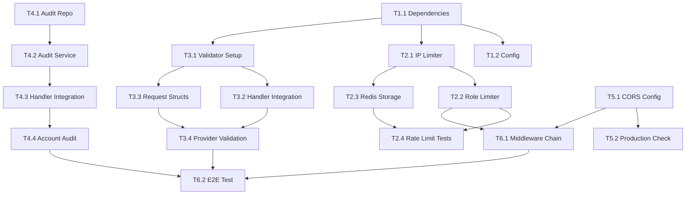

# Security Middleware - Task Breakdown

> **Spec**: [spec-security-middleware.md](./spec-security-middleware.md)
> **Plan**: [plan-security-middleware.md](./plan-security-middleware.md)
> **Feature ID**: SEC-001

---

## Overview

| Metric          | Value         |
| --------------- | ------------- |
| Total Tasks     | 18            |
| Estimated Hours | 16-20h        |
| Sprint          | 1             |
| Priority        | P0 (Critical) |

---

## Task Groups

### Group 1: Dependencies & Config (2 tasks)

- [ ] **T1.1** Add go-playground/validator and gofiber/storage/redis to go.mod
  - File: `apps/api/go.mod`
  - Effort: 5 min
  - Verification: `go mod tidy` succeeds

- [ ] **T1.2** Extend Config struct with rate limit and CORS fields
  - File: `apps/api/internal/config/config.go`
  - Effort: 20 min
  - Verification: Config loads from env vars

---

### Group 2: Rate Limiting (4 tasks)

- [ ] **T2.1** Create IP-based rate limiter middleware
  - File: `apps/api/internal/middleware/rate_limiter.go` (NEW)
  - Effort: 45 min
  - Dependencies: T1.1
  - Verification: 110 requests → last 10 get 429

- [ ] **T2.2** Create role-based rate limiter middleware
  - File: `apps/api/internal/middleware/role_limiter.go` (NEW)
  - Effort: 30 min
  - Dependencies: T2.1
  - Verification: super_admin unlimited, agent limited

- [ ] **T2.3** Add Redis storage for rate limiting
  - File: `apps/api/internal/middleware/rate_limiter.go`
  - Effort: 20 min
  - Dependencies: T2.1
  - Verification: Rate limits persist across restart

- [ ] **T2.4** Unit tests for rate limiters
  - File: `apps/api/internal/middleware/rate_limiter_test.go` (NEW)
  - Effort: 30 min
  - Dependencies: T2.1, T2.2
  - Verification: `go test` passes

---

### Group 3: Input Validation (4 tasks)

- [ ] **T3.1** Create validator setup with custom validators
  - File: `apps/api/internal/middleware/validator.go` (NEW)
  - Effort: 45 min
  - Dependencies: T1.1
  - Verification: UUID, phone, role validators work

- [ ] **T3.2** Add Validate helper to Handler struct
  - File: `apps/api/internal/handlers/handler.go`
  - Effort: 20 min
  - Dependencies: T3.1
  - Verification: h.Validate() returns formatted errors

- [ ] **T3.3** Create request structs for providers
  - File: `apps/api/internal/handlers/requests.go` (NEW)
  - Effort: 30 min
  - Dependencies: T3.1
  - Verification: Structs have validation tags

- [ ] **T3.4** Update provider handlers to use validation
  - File: `apps/api/internal/handlers/stubs.go`
  - Effort: 30 min
  - Dependencies: T3.2, T3.3
  - Verification: Invalid request returns 400 with details

---

### Group 4: Audit Logging (4 tasks)

- [ ] **T4.1** Create audit repository
  - File: `apps/api/internal/repositories/audit_repository.go` (NEW)
  - Effort: 20 min
  - Verification: CRUD operations work

- [ ] **T4.2** Create audit service with async logging
  - File: `apps/api/internal/services/audit_service.go` (NEW)
  - Effort: 30 min
  - Dependencies: T4.1
  - Verification: Logs written without blocking request

- [ ] **T4.3** Add AuditService to Handler and helper method
  - File: `apps/api/internal/handlers/handler.go`
  - Effort: 15 min
  - Dependencies: T4.2
  - Verification: h.Audit() callable from handlers

- [ ] **T4.4** Add audit logging to Account handlers
  - File: `apps/api/internal/handlers/stubs.go`
  - Effort: 20 min
  - Dependencies: T4.3
  - Verification: Create/Update/Delete generate logs

---

### Group 5: CORS Enhancement (2 tasks)

- [ ] **T5.1** Update CORS config with origin validation
  - File: `apps/api/cmd/server/main.go`
  - Effort: 20 min
  - Verification: Unknown origin blocked

- [ ] **T5.2** Add production wildcard validation
  - File: `apps/api/cmd/server/main.go`
  - Effort: 10 min
  - Verification: Startup fails with \* in production

---

### Group 6: Integration (2 tasks)

- [ ] **T6.1** Update main.go middleware chain order
  - File: `apps/api/cmd/server/main.go`
  - Effort: 15 min
  - Dependencies: T2.1, T2.2, T5.1
  - Verification: All middlewares in correct order

- [ ] **T6.2** End-to-end integration test
  - File: `apps/api/test-security.sh` (NEW)
  - Effort: 30 min
  - Dependencies: All previous
  - Verification: Script tests all security features

---

## Execution Order

---

## Parallel Tracks

| Track A (Rate Limiting)          | Track B (Validation)             | Track C (Audit)           |
| -------------------------------- | -------------------------------- | ------------------------- |
| T1.1 → T2.1 → T2.2 → T2.3 → T2.4 | T1.1 → T3.1 → T3.2 → T3.3 → T3.4 | T4.1 → T4.2 → T4.3 → T4.4 |

Tracks A, B, C podem ser executadas em paralelo após T1.1.

---

## Implementation Order (Sequential)

1. **T1.1** - Dependencies ✓
2. **T1.2** - Config ✓
3. **T2.1** - IP Rate Limiter
4. **T3.1** - Validator Setup
5. **T4.1** - Audit Repository
6. **T2.2** - Role Rate Limiter
7. **T3.2** - Handler Validate Helper
8. **T3.3** - Request Structs
9. **T4.2** - Audit Service
10. **T2.3** - Redis Storage
11. **T3.4** - Provider Validation
12. **T4.3** - Handler Audit Helper
13. **T4.4** - Account Audit
14. **T5.1** - CORS Config
15. **T5.2** - Production Check
16. **T6.1** - Middleware Chain
17. **T2.4** - Rate Limit Tests
18. **T6.2** - E2E Test

---

**Ready for Implementation**: Yes
**Next Step**: Execute T1.1
